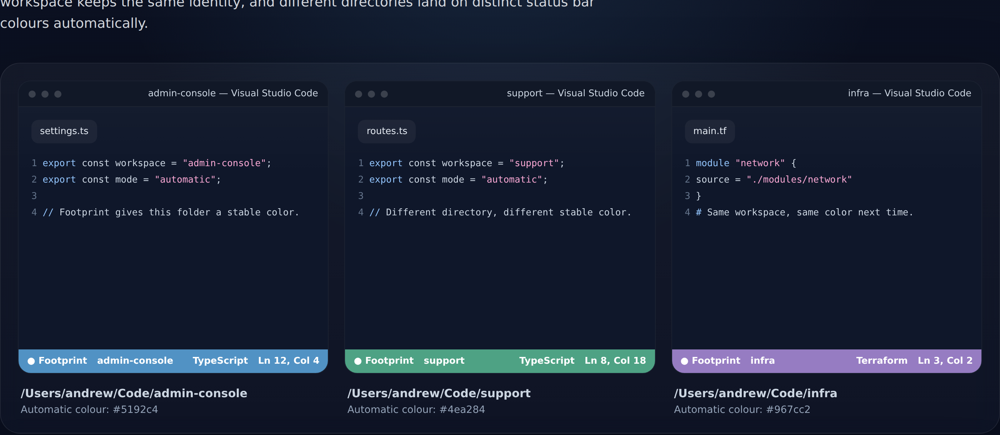
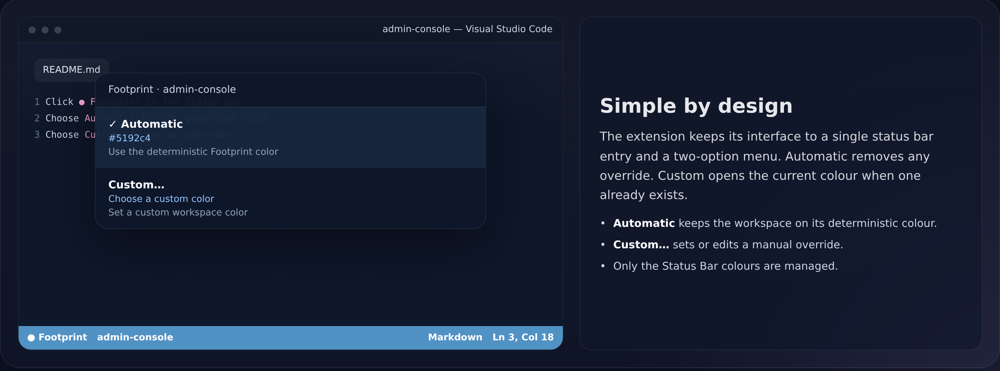

# Footprint

## Automatic status bar identity for VS Code workspaces.

Footprint gives every VS Code workspace its own colour automatically.

When you have several projects open at once, it is easy to lose track of which window belongs to which project. Footprint gives each workspace a distinctive, deterministic status bar colour so you can identify it at a glance.

**No setup. No project files.**

### In use

Different directories get different stable status bar colours:

The interface stays intentionally small:

### How it works

Footprint derives a stable identity from the workspace location and uses it to select a colour from a curated palette.

The same workspace gets the same colour every time:

**Same workspace, same colour, every time.**

Different workspaces are assigned colours independently, so opening or closing another workspace never changes an existing workspace's colour.

Colours are generated locally. No account or external service is required.

### Automatic or custom

Click **● Footprint** in the VS Code Status Bar:

- **✓ Automatic** — let Footprint choose the workspace colour.
- **Custom…** — choose your own colour.

When a custom colour is active, **Custom…** opens the current colour so you can edit it. Select **Automatic** to return to the generated colour.

### Why Footprint?

If you regularly work across several VS Code windows, Footprint makes it easier to recognize the one you want without adding project-specific setup or extra UI.

### Features

- Automatic deterministic workspace colours
- Custom workspace colours
- Perceptual colour selection
- No project configuration required
- No external services
- VS Code only

### Privacy

Footprint generates colours locally from workspace identity. It does not send workspace paths or project information to an external service.

### About

Footprint is a Waka Apps project by Andrew Drake.

[waka.nz](https://waka.nz)

## License

MIT
