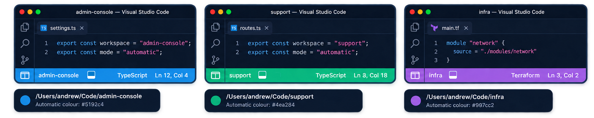
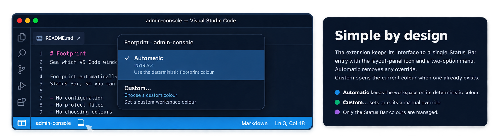

# Footprint

**See which VS Code window you're looking at.**

## Overview 

If you work on several projects at once, you probably have several VS Code windows open too.

And when they're all using the same dark theme, **they can start to look exactly the same.**

Footprint automatically gives each workspace or folder a **distinctive colour in the VS Code Status Bar**, so you can recognise your projects at a glance.

**Open a project. Footprint gives it a colour.**

## Built for people with too many VS Code windows

Footprint gives every VS Code workspace and folder its own color. It is an automatic workspace color solution for VS Code, giving every project window a stable visual identity without configuration.

When you have several projects open at once, it is easy to lose track of which window belongs to which project. Footprint gives each workspace a distinctive, deterministic status bar color so you can identify it at a glance.

It is a little like the Peacock extension, except Footprint automatically selects a stable workspace color for you instead of requiring you to choose one for each project.

**No setup. No project files.**

## In use

Different directories and workspaces get different stable status bar colors:

The interface stays intentionally small:

## How it works

Footprint derives a stable identity from the workspace location and uses it to select a color from a curated palette.

The same workspace gets the same color every time:

**Same workspace, same color, every time.**

Different workspaces are assigned colors independently, so opening or closing another workspace never changes an existing workspace's color.

colors are generated locally. No account or external service is required.

### Automatic or custom

Click the **Layout Panel** icon in the VS Code Status Bar:

- **✓ Automatic** — let Footprint choose the workspace color.
- **Custom…** — choose your own color.

When a custom color is active, **Custom…** opens the current color so you can edit it. Select **Automatic** to return to the generated color.

### Why Footprint?

If you regularly work across several VS Code windows, Footprint makes it easier to recognize the one you want without adding project-specific setup or extra UI.

### Features

- Automatic deterministic workspace colors
- Custom workspace colors
- Perceptual color selection
- No project configuration required
- No external services
- VS Code only

### Privacy

Footprint generates colors locally from workspace identity. It does not send workspace paths or project information to an external service.

### About

Footprint is a Waka Apps project by Andrew Drake.

[waka.nz](https://waka.nz)

## License

MIT
